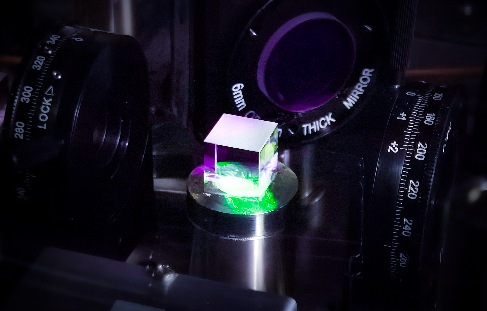

I am a PhD candidate of quantum science and technology and my research interests are showed below.

1.Ultracold atoms and quantum simulation；

2.The applications of [Non-markovian stochastic schordinger equation](Non-markovian_stochastic_schordinger_equation.md) and open quantum system；

3.Many-body physics and strongly correlated system；

